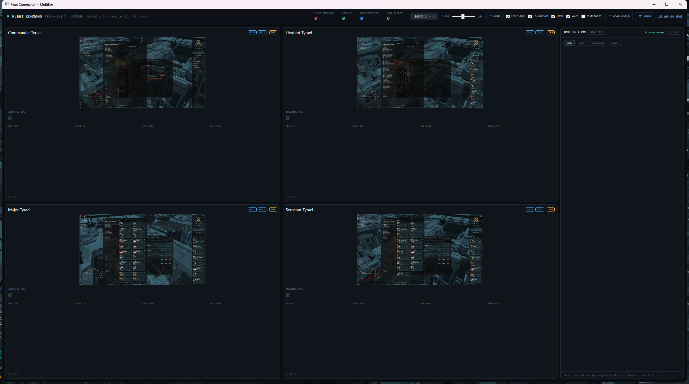
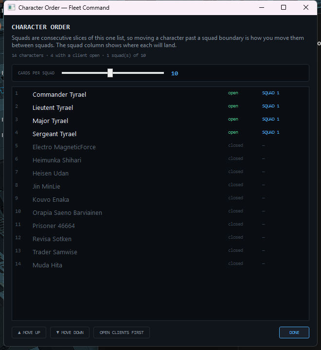
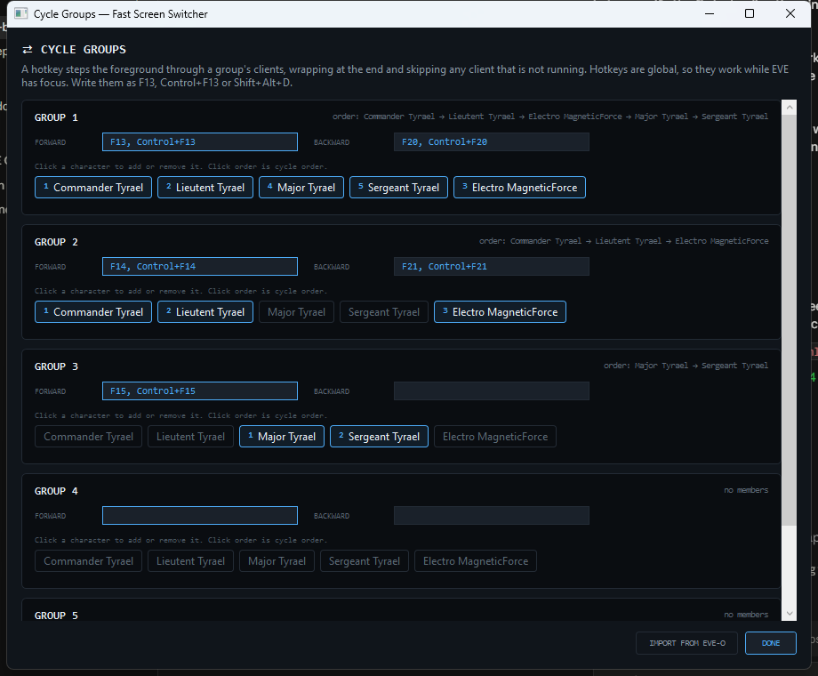

# MultiBox user guide

Fleet Command is one screen that replaces a PyEveLiveDPS window per character, an eve-o-preview
thumbnail grid, and four copies of every chat channel.

---

## Before you start

You need:

- Windows 10 or 11
- Either the self-contained build (nothing to install) or the .NET 10 Desktop Runtime
- EVE logging enabled — it is on by default

Check your setup before running the dashboard:

```bash
.\dist\win-x64-standalone\multibox-replay.exe doctor
```

`doctor` prints where your logs are, which characters it found, which window title it expects
for each, and which EWAR effects are detectable at all. If it lists your pilots, the dashboard
will work.

---

## The dashboard



### Header

Left to right: the fleet totals, then your controls.

| Readout | Meaning |
|---|---|
| **FLEET INCOMING** | every pilot's incoming DPS, added up |
| **REPS IN** | remote repair landing on the fleet |
| **NEUT PRESSURE** | capacitor being drained off the fleet |
| **EWAR ALERTS** | how many effects are on the fleet right now — green at zero, red otherwise |

`SQUAD 1 · 4` switches tabs. `CARDS` sets how many cards a squad holds, from 1 to 20 — squads
are consecutive slices of the character order, so lowering it pushes the overflow onto the
next tab. `≡ ORDER` opens the ordering window. The checkboxes toggle showing only open
clients, thumbnails, flashing alerts, spoken warnings and the alert tones. `⇄ CYCLE GROUPS`
opens the Fast Screen Switcher, and `🔊 VOICE` plays a test announcement. The clock is EVE
time.

### Which characters get a card

**Only characters whose client is currently open.** EVE's log files outlive the client that
wrote them, so a card per log file would mean every alt that undocked today keeping a slot for
the rest of the evening. The status line says how many known characters are closed — "Watching
14 character(s). 10 closed" means four cards and ten pilots it knows about but is not showing.

Untick **Open only** to show every character it has ever seen a log for this session.

### A character card

Each card is one pilot, top to bottom:

- **Name, ship and role.** The ship fills in once another client witnesses something landing
  on you — your own log says "you" rather than naming your hull. The role chip
  (`DPS`/`LOGI`/`CMD`/`EWAR`) comes from your config. Blue `G1·3` tags show cycle-group
  membership and position.
- **Live thumbnail.** Your actual client, drawn by Windows. Click it to bring that client to
  the front. The hotkey label sits in the corner.
- **INCOMING DPS**, with the two sparklines behind it: red is incoming damage, green is reps
  received, both on the same scale so you can see whether the green is keeping up.
  - `▲ EXCEEDS REPS` in red — damage is outrunning your logi. The block pulses red.
  - `● REPS HOLDING` in green — you are being shot but the reps are keeping pace.
- **Four numbers**: DPS OUT, REPS IN, CAP XFER, NEUT/NOS. A dash means nothing is happening,
  which is deliberately distinct from a zero reading.
- **Combat log** for that pilot, colour-coded: bright red for heavy hits, muted red for chip
  damage, green for reps, blue for cap, and each EWAR effect in its own colour.
- **EWAR badges** along the bottom, naming who is doing it — `SCRAM Ares "Vint-1"`. A web
  flashes rather than merely sitting there. `NO EWAR` when you are clear.

When any effect lands, the whole card border pulses red.

### Ordering a large fleet



Dragging cards works well for a handful. For twenty, use `≡ ORDER`.

The list is the whole fleet in one order, and squads are consecutive slices of it — so moving
a character past a squad boundary is how you move them between squads. Each row shows whether
that client is open and which squad it will land in, since that is the consequence of a move
you would not otherwise see. `OPEN CLIENTS FIRST` sorts every running client to the top while
keeping their relative order.

The slider here is the same one as in the header, repeated because the squad boundaries are
what you are arranging against.

### Unified comms

One read-only feed of every channel across every client, newest first.

`CLEAR` empties the panel when the backlog stops being relevant. It clears the **view only** —
the session keeps its history, and nothing on disk is touched. Messages arriving afterwards
appear as normal.

Four clients in the same fleet channel write the same message four times. The panel collapses
those into one row and marks it `×4`. A `×1` on a fleet message is information too — it means
only one of your characters was in that channel. Hover the count to see who saw it.

The chips filter by channel: `ALL`, `CORP`, `ALLIANCE` and `LOCAL` are pinned first, then
every other channel alphabetically. Intel channels are coloured red.

There is no way to type back. That is deliberate — there is no input path to the game
anywhere in this application.

---

## Fast Screen Switcher (cycle groups)



A cycle group is an ordered ring of characters and a hotkey. Press the hotkey and the next
client in the ring comes to the foreground; press it again and you move on, wrapping at the
end. Clients that are not running are skipped, so a group survives a character being logged
out. A backward hotkey walks the same ring the other way, starting from its last member.

**Switching groups starts the new group over.** If you cycle part-way through group 1, use
group 2, then press group 1 again, group 1 restarts at its first member rather than resuming
where you left it. A group's hotkey therefore always means "take me to the top of this
group", and never depends on what you did several keypresses ago.

Open it with `⇄ CYCLE GROUPS`. For each of the five groups:

- **FORWARD** and **BACKWARD** take hotkeys written as `F13`, `Control+F13`, `Shift+Alt+D`.
  Several are allowed, comma-separated. Backward is optional.
- Click a character to add it; click again to remove it. **Click order is cycle order**, shown
  as the number on the chip and spelled out on the `order:` line.

Hotkeys are global — they work while EVE has focus, which is the entire point. They take
effect the moment you type them, so you can test one without restarting.

If Windows refuses a hotkey because another application already owns it, the window says so
in red rather than silently doing nothing.

### Importing from EVE-O Preview

`IMPORT FROM EVE-O` reads `%LOCALAPPDATA%\EVE-O Preview\EVE-O Preview.json` and takes your
cycle groups, aliases and window layout as they are. Where two clients share a position —
which eve-o allows — the order in the file is kept.

---

## Configuration

Settings live in `%APPDATA%\MultiBox\multibox.json`, written when you close the app. Most of
it is managed from the UI; these are worth editing by hand:

| Key | What it does |
|---|---|
| `CharacterRoles` | `{"Juno Vael": "LOGI"}` — the chip on the card. Roles cannot be guessed from a log, so they are declared. |
| `StatWindowSeconds` | Seconds behind the DPS and reps figures. Default 10, as PyEveLiveDPS uses. |
| `EwarHoldSeconds` | How long an effect stays lit without a refreshing log line. Default 12. |
| `ChatChannels` | Channels to follow. Empty means all of them. |
| `Alerts` | Tone, frequency, duration and cooldown per EWAR type. |
| `SquadSize` | Cards per squad tab. Default 10, and set by the header slider. |
| `ShowOnlyRunningClients` | Show a card only while the client is open. Default true. |
| `CharacterOrder` | Fleet order by name, set by dragging cards or the ordering window. |
| `ClickToFocus` | Set false to make thumbnails inert. |

---

## What it cannot tell you

Worth knowing before you rely on it in a fight.

**Webs, target painters, sensor dampeners and tracking disruptors cannot be detected.** EVE
writes no game-log line when they are applied to you. No tool that reads logs can see them —
this is a limit of the data, not of the parser. The only technique that could is reading the
HUD off the screen, which this application deliberately does not do.

**CAP XFER is unverified.** No captured log in `samples/` contains a capacitor transfer, so
that one pattern is written from EVE's documented log format rather than from a real line.
Every other figure on the dashboard is derived from patterns tested against real logs.

**Your ship shows only once someone else sees you.** Your own log calls you "you".

---

## Troubleshooting

**No characters.** Run `multibox-replay.exe doctor`. If it finds no logs, check that logging
is enabled in EVE and that the folders it prints are where your client is actually writing.

**Thumbnails are blank.** The client has to be running and logged in — a character-select
screen has the bare title `EVE` and is skipped. Check that the card shows the pilot's name.

**A hotkey does nothing.** Another application probably owns it; the cycle groups window lists
any that Windows refused. `F13`–`F24` are usually free.

**Clicking a thumbnail does not switch.** Windows can refuse a foreground change under its own
focus rules. Click the dashboard first, then the thumbnail.

**No spoken warnings.** The machine needs a speech voice installed. Tones still work.
